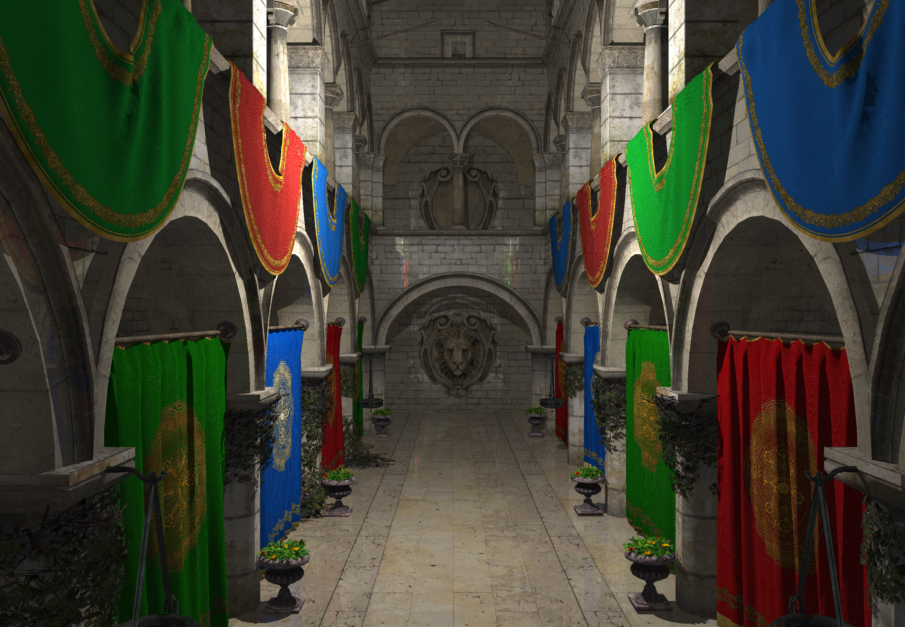
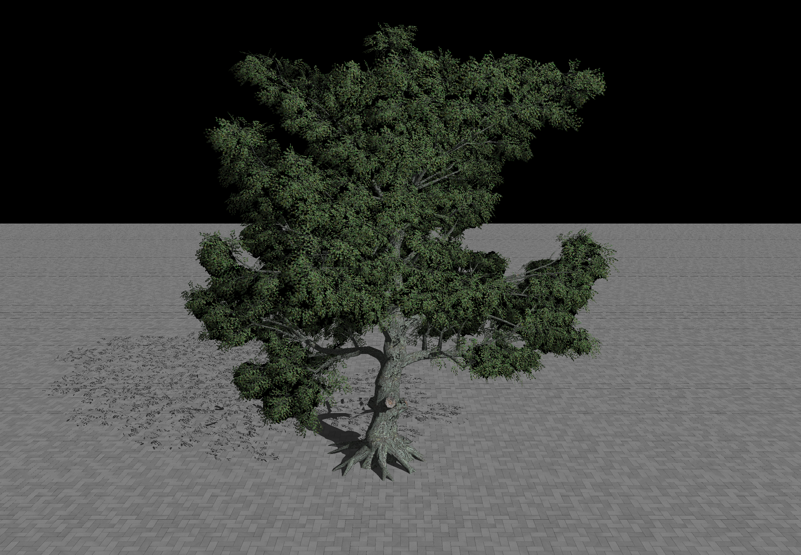
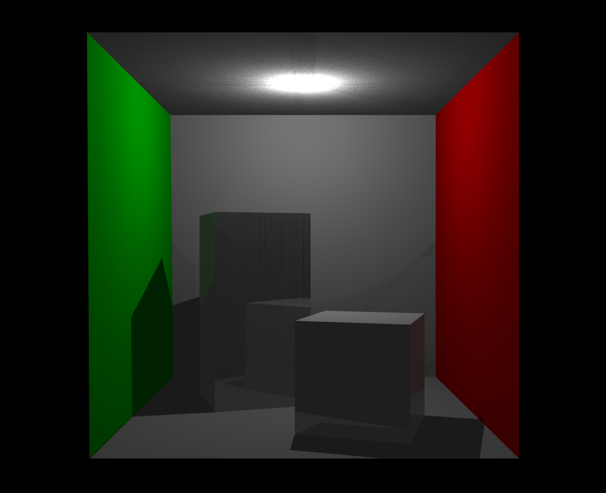
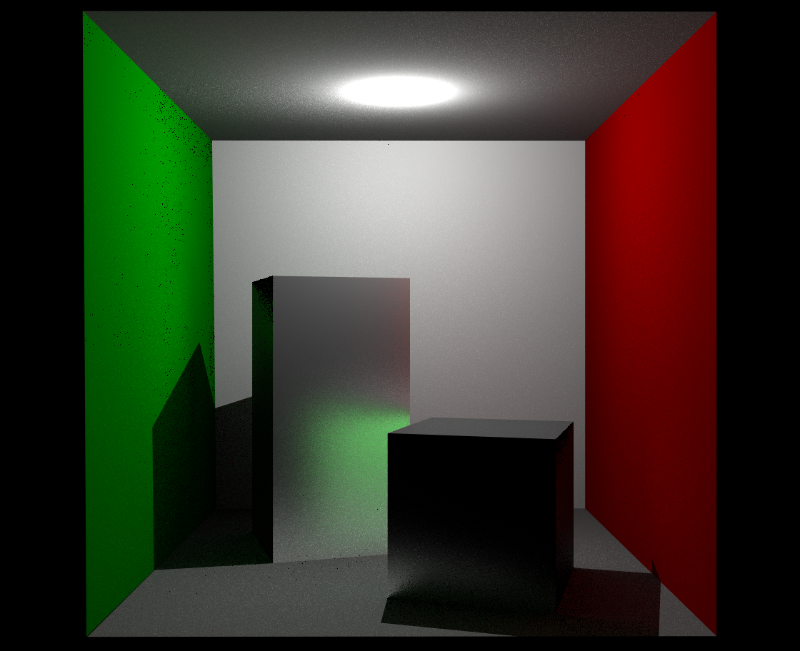
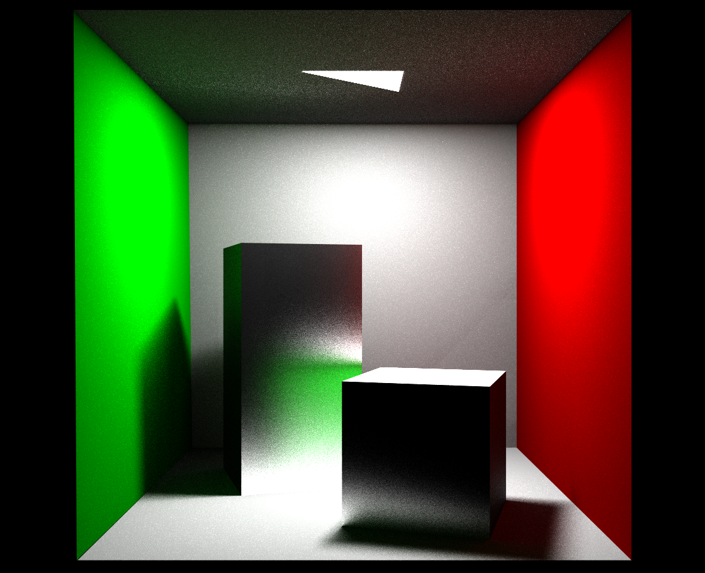
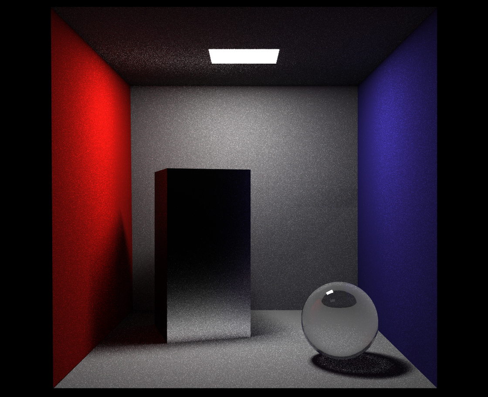
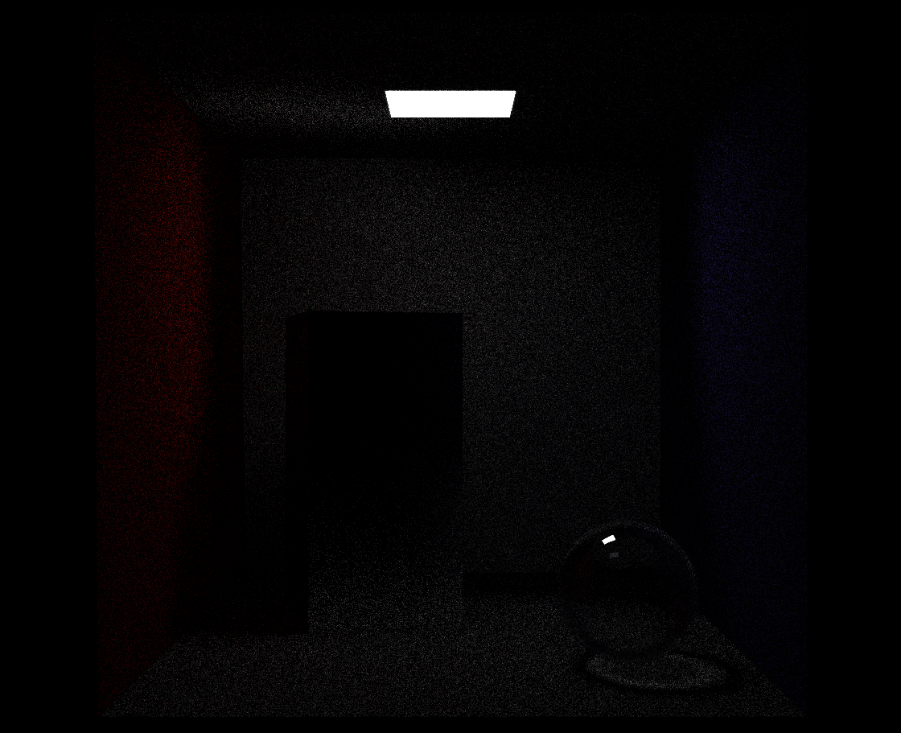

# 可视计算与交互概论 期末大作业: 路径追踪(C 5)

## 1. 选题描述

### 背景描述

在课程和作业中，我们已经完成了 Whitted 风格的光线追踪，这种光线追踪初步实现了光线的反射、折射、阴影等效果。然而，这种光线追踪的效果并不是很好，因为它只考虑了光线与物体的交互，而在视线光线与某个物体相交之后，其只使用了 Phong shading 做了简单的着色，没有考虑到光线在物体内部的传播，也没有考虑到光线在物体表面的散射等现象。因此，我们希望在期末大作业中实现一种更加真实的光线追踪算法，即路径追踪算法。

路径追踪的核心是渲染方程，其表达式如下：

$$
L_o (x, w) = L_e (x, w) + \int_\Omega f_r (x, w', w) L_i (x, w') (w \cdot n) d w'
$$

使用蒙特卡洛积分的方法，我们可以对上式进行近似求解，从而得到真实感更强的光线追踪效果。

本项目基于 VCL lab 项目框架，通过路径追踪实现了软影、全局光照、焦散（效果相对不明显）等效果，最终实现了一个简单的路径追踪渲染器。

### 亮点

1. 实现了路径追踪算法，实现了软影、全局光照、焦散等效果。
2. 实现了 BVH 树，加速了光线追踪的速度。
3. 实现了 BRDF 加权采样，提高了采样效率，在较低的 spp 时也能获得较好的效果。
4. 实现了光源采样和直接光照，提高了渲染效果。
5. 按照 spp 的顺序，依次绘图，更加直观感受到 spp 变化造成的渲染效果差异。

### 编译

```sh
xmake build ray-tracing && xmake run ray-tracing

## 2. 实现思路

### 2.1 空间加速结构

为了能有效地实现光线追踪，我首先实现了一个空间加速结构，即 BVH 树。BVH 树是一种二叉树，其每个节点代表了一个包围盒，左右子节点分别代表了包围盒的两个子区域。通过 BVH 树，我们可以快速地找到光线与场景中物体的交点。

基于此，我们实现了 `BVHRayIntersector`，这个求交器成功地渲染了 `White Oak` 和 `Sponza` 两大型场景。渲染时间在 `max_depth=7` 时分别为 `5 min` 和 `25 min`。需要特别指出的是，由于我本机为高分屏，似乎其渲染图片大小也比较大，为 `2706*1800`，故渲染时间较长。

### 2.2 路径追踪

首先根据渲染方程，需要重新开启 light 面片，且设置其 material 为 `light`，含有 `Emission` 属性。在每次追踪时，若光线与 light 面片相交，则其 $L_e$ 为 `Emission`。但由于原本框架并没有这个属性，所以我们需要修改 `scene.cpp`、`loader.cpp`、`rayIntersector.cpp` 等文件，使其能够正确地加载、在 rayHit 中返回 light 面片。整体难度不高，但较为麻烦。

其次，我们需要实现路径追踪的核心算法。在 `pathTracer.cpp` 中，我们实现了 `pathTracer` 函数，其核心思想是通过蒙特卡洛积分的方法，对渲染方程进行近似求解。在每次追踪时，我们首先判断光线与场景中的物体是否相交，若相交，则根据 BRDF 加权采样的方法，计算光线的反射、折射方向，并递归调用 `pathTracer` 函数。在递归调用的过程中，我们需要考虑光线的反射、折射、散射等情况，从而得到最终的颜色值。

### 2.3 直接光照

在路径追踪中，由于光线的反射、折射等情况，我们需要追踪很多次光线，从而得到最终的颜色值。为了提高渲染效率，我们可以考虑直接光照的方法。即在每次追踪时，我们单独考虑该点的直接光照情况，从而减少方差，加速渲染。

### 2.4 BRDF 加权采样

在路径追踪中，我们需要对 BRDF 进行采样，从而得到光线的反射、折射方向。为了提高采样效率，我们可以考虑 BRDF 加权采样的方法。即在采样时，不选择随机采样，而是优先对 BRDF 较高的方向采样，这样可以减少方差，提高渲染效果。

由于我们采用了 Phong BRDF，其 BRDF 采样权值应当仅与表面的光滑度有关，故我们选择 $ \phi = 2 \pi u, \theta = \cos^{-1}(v^{(\text{shininess} + 1)}) $ 的方法采样，这样使得采样密度最高点位于其 BRDF 最高点。

### 2.5 玻璃球的处理

这里借鉴了 `smallpt` 的处理办法，对于玻璃球，若其面片的 n 和光线的方向相反，则其为向内的折射，否则为射出。这样可以确定每次折射相对的 $n_1/n_2$ 值。对于 $n_1/n_2 < 1$ 的情况，我们需要使用全反射。对于折射、反射光强的分配，我们使用了 `Fresnel` 公式。设定阈值，随机数高于阈值折射，否则反射，得到了较好的效果。

### 2.6 界面设计

对于 Path Tracing 的界面，我做了如下改动。首先将原先的一个进度条变为两个，分别表示该次采样的进度和总体的进度。其次，我增加了 P_RR 的滑动条、spp 滑动条、shadow ray、BRDF、直接光照的勾选框，可以方便地调整这些参数，观察不同参数下的渲染效果。

## 3. 实验结果展示

### 3.1 空间加速结构




### 3.2 路径追踪与光线追踪对比





仔细看可以看到，我实现的路径追踪在面光源中实现了软影，在所有情况下实现了全局光照。其真实感相对于光线追踪有了很大的提升。

### 3.3 玻璃球和焦散




成功实现了玻璃球的透光和反射效果，可以看到焦散现象。在关闭直接光照的右图中，焦散更加明显。
```
